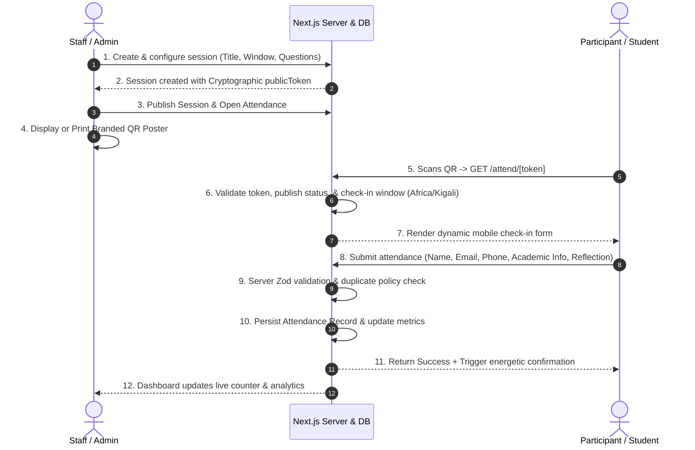

# Data Flow & Lifecycle — NiCE Club Attendance Platform

## 1. End-to-End Operational Lifecycle

The system coordinates between organizers creating scientific events and participants checking in over mobile devices:

## 2. Status Derivation Logic

Session status is determined dynamically according to the current timestamp in `Africa/Kigali`:

1. **DRAFT**: Session has not been published by an organizer. Public token rejects submissions.
2. **UPCOMING**: Published, but current time is before `attendanceOpens`.
3. **OPEN**: Current time is between `attendanceOpens` and `attendanceCloses`.
4. **CLOSING_SOON**: Open, with 15 minutes or less remaining until `attendanceCloses`.
5. **CLOSED**: Current time is past `attendanceCloses` or manually toggled closed by staff.

Submissions to sessions in any state other than `OPEN` or `CLOSING_SOON` are safely rejected with descriptive guidance.
