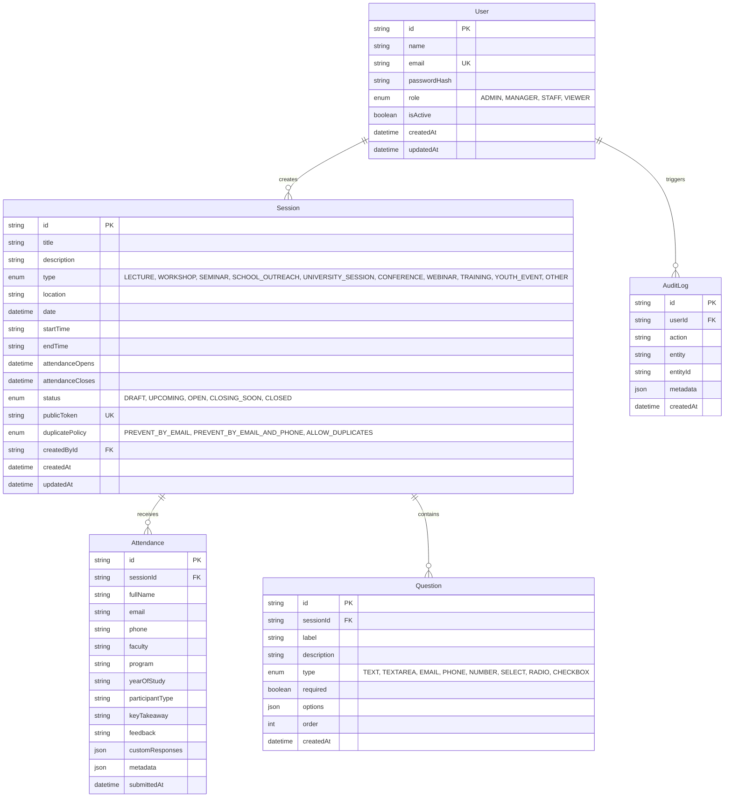

# Database Design — NiCE Club Attendance Platform

## 1. Overview

The persistent data layer is implemented in PostgreSQL and modeled via Prisma ORM. The schema models the complete lifecycle of organizers, scientific sessions, public attendance entries, configurable custom questions, and administrative audit trails.

## 2. Entity-Relationship Diagram

## 3. Indexing Strategy

To guarantee rapid query response times under high-volume simultaneous check-in conditions:

- `Session.publicToken`: Unique index for \(O(1)\) public QR verification lookup.
- `Session.status` & `Session.date`: Composite index for rapid dashboard filtering.
- `Attendance.sessionId` & `Attendance.email`: Index for duplicate attendance verification and session roster display.
- `Attendance.submittedAt`: Index for real-time timeline analytics.
- `User.email`: Unique index for authentication.

## 4. Duplicate Prevention Logic

Configured per-session:
1. `PREVENT_BY_EMAIL` (default): Checks `(sessionId, normalizedEmail)`.
2. `PREVENT_BY_EMAIL_AND_PHONE`: Checks `(sessionId, normalizedEmail)` OR `(sessionId, normalizedPhone)`.
3. `ALLOW_DUPLICATES`: Permits multiple participations (e.g. continuous multi-day or repeated lab entries).
