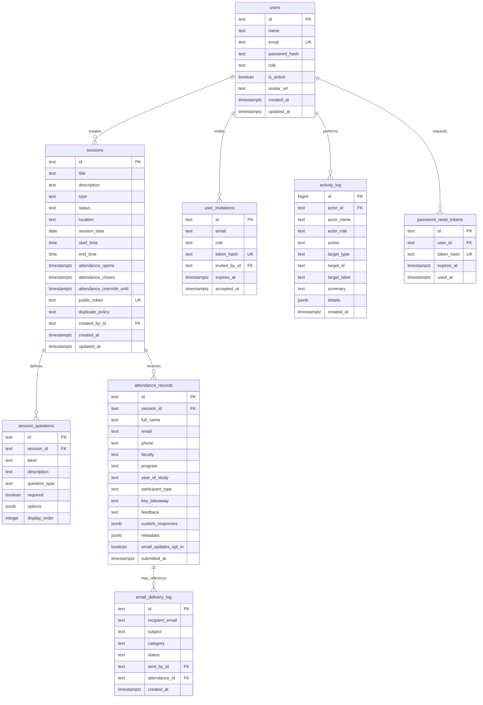

# Database Design — NiCE Club Attendance Platform

## 1. Overview

PostgreSQL is the production source of truth. The application uses parameterized SQL through the `pg` connection pool in `src/lib/database/client.ts`; it does not use Prisma. Schema changes are applied in order from `database/migrations` with `npm run db:migrate`.

## 2. Entity relationships

The email log stores delivery metadata, not email message bodies or provider secrets. Activity rows keep actor name and role snapshots so an audit entry remains readable if an account is later removed. Temporary attendance extensions expire using the database timestamp; check-in validates the normal window or active override while holding the session row lock.

## 3. Data integrity and indexes

- Staff emails are unique and normalized before lookup or persistence.
- Public attendance tokens are random and unique; public URLs do not expose sequential database IDs.
- Attendance rows reference sessions with `ON DELETE RESTRICT`. Session deletion explicitly removes attendance inside a transaction; session questions cascade with their session, while linked email-log history is retained with a null attendance reference.
- Password-reset and invitation tokens are hashed before storage and expire.
- Check-in and session mutations use server-side role checks. Activity-log reads are admin-only.
- Session status/date, attendance session/submission time, email delivery time, activity time/actor, and token lookup fields have supporting indexes in the migration set.

## 4. Duplicate attendance policy

Each session chooses one policy:

1. `PREVENT_BY_EMAIL` (default): reject a repeat email for the same session.
2. `PREVENT_BY_EMAIL_AND_PHONE`: reject a matching email or phone for the same session.
3. `ALLOW_DUPLICATES`: accept repeat submissions.

The server locks the session row while it evaluates the current attendance window, checks duplicates, and inserts a check-in. This serializes competing submissions and an administrator closing a temporary extension.
